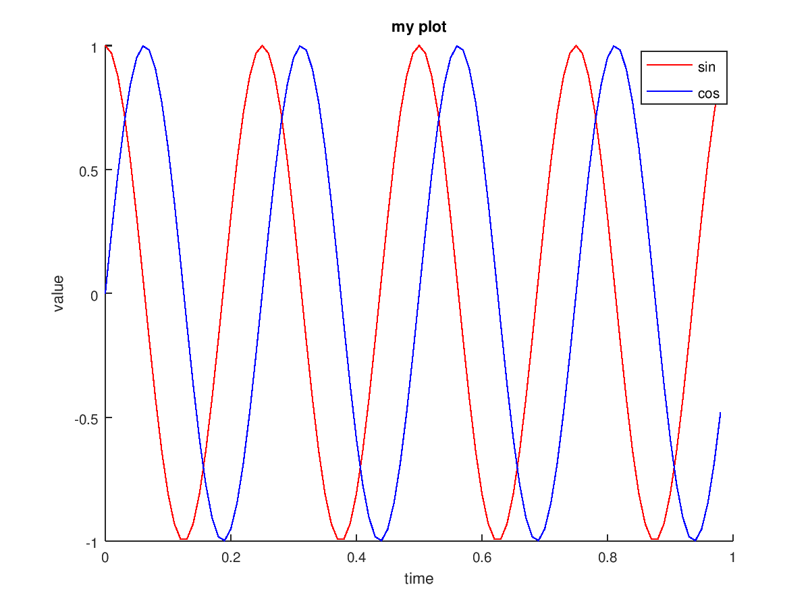

# [Coursera Machine Learning course](https://www.coursera.org/learn/machine-learning)

## Week 1

### What is Machine Learning

> The field of study that gives computers the ability to learn without being explicitly programmed.
> – Arthur Samuel

More recently:

> A computer program is said to learn from experience E, with respect to some task T, and some performance measure P, if its performance on T as measured by P improves with experience E.
> – Tom Mitchel

Example: playing checkers.

- E = the experience of playing many games of checkers
- T = the task of playing checkers.
- P = the probability that the program will win the next game.

Types of machine learning:

- Supervised learning
- Unsupervised learning
- (Reinforcement learning)
- (Recommender systems)

### Supervised Learning

Example: house prices, "right answers" are given

"Fit a model in the data"

- **Regression** problem: Continuous value output
- **Classification** problem: Discrete valued output

Feature = attribute

### Unsupervised Learning

Structure of the data - clusters

Applications of clustering algorithms:

- Computing clusters organisation
- Market segmentation
- Social network analysis
- Astronomical data analysis

### Model Representation

Linear regression!

Housing prices: Price (1000s $), Size (feet squared)

Training set

Notation:

- **m** = Number of training examples
- **x**'s = "input" variable / features
- **y**'s = "output" variable / "target" variable
- **(x, y)** = One training example
- **(x(i), y(i))** = i-th training example

"Univariate" linear regression

> learn a function h : X → Y so that h(x) is a “good” predictor for the corresponding value of y. For historical reasons, this function h is called a hypothesis.

```
          ┌─────────────────┐
          │   Training set   │
          │                  │
          └─────────────────┘
                   │
                   │
                   ▼
          ┌─────────────────┐
          │    Learning      │
          │    algorithm     │
          └─────────────────┘
                   │
                   │
      x            ▼        predicted y
                 ┌───┐
(living area ───▶│ h │───▶  (predicted
  of house)      └───┘    price of house)
```

### Cost function

"Minimise the difference between the hypotheses and the actual value"

Squared error function: Average difference (actually a fancier version of an average) of all the results of the hypothesis with inputs from x's and the actual output y's.

Works well for most problems. Most common (for linear regression problems). There are other cost functions.

Contour plots - charts concentric circles of equal values for a given set of variables

### Gradient descent

Very common algorithm. Not just linear regression.

- Start with some θ0 and θ1
- Keep changing θ0, 01 to reduce J(θ0, θ1) until we hopefully end up at a minimum

Local minimums / local optimums! Common starting value: 0, 0


Follow the derivative (tangent line) of the cost function, down slope.

Simultaneous updated of both θ0 and θ1 (interdependent)

Alpha gradient descent step:

- Too small, gradient descent too slow
- Too large, overshoot the minimum, fail to converge, *or even diverge*.

Eventually converges regardless of learning rate alpha, because derivative tends to 0, thus taking smaller steps.

Convex function (bowl shaped): no local optima, just one global optimum.

Quadratic gradient descent:


## Matrices and Vectors

> Matrix: Rectangular array of numbers

Dimension of matrix: number of rows x number of columns

> Vector: Matrix with n x 1 dimension

Identity matrix, denoted I or ][n*m

## Week 2

### Octave

- Install: `brew install octave`.
- Start: `octave`

```sh
# Install
brew install octave
# Start
octave
# Help
help <func_name>
```

### Multivariate Linear Regression

Notation:

- `n` = number of features
- `x(i)` = input (features) of i-th training example
- `x(i)j` = value of feature j in i-th training example

Hypothesis, multivariate edition:

```python
hθ(x) = θ0 + 01x1 + θ2x2 + θ3x3 + θ4x4
# Any number of variables, with x0 = 1.
hθ(x) = θ0x0 + 01x1 + ... + θnxn
```

#### Gradient descent – Feature scaling

If features use different scales, gradient descent will be very slow (lots of steps). The countour graph is very skewed.

Put all features on the same scale - approximate value range: -1 <= xi <= 1 range (not smaller, not bigger). Rule of thumb: -3 – 3, -1/3 – 1/3 are ok

Mean normalisation: Give features a 0 mean by reducing all feature values by the prev mean (in training set).

```python
# u1 = avg
# s1 = sd, or range
x1 <- (x1 - u1) / s1
```

#### Gradient descent – Learning rate

Plot J(θ) cost function per number of iterations. J(θ) should decrease after every iteration.

See after how many iterations the gradient descent has converged.

Gradient descent not working - most common reason is too high learning rate α.

- For sufficiently small α, J(θ) should decrease on every iteration.
- But if α is too small, gradient descent can be slow to converge.
- Try α: 0.001, 0.003, 0.01, 0.03, 0.1, 0.3, 1 (steps of 3x)

#### Features and polynomial regression

Housing prices prediction: hθ(x) = θ0 + θ1 * frontage + θ2 * depth, or hθ(x) = θ0 + θ1 * area (frontage * depth)

Instinct for the shape of the data based on the shape of different regressions - quadratic, cubic, square root. Use feature scaling accordingly.

- Combine multiple features into one.

### Computing parameters analytically

#### Normal equation

> Method to solve for θ analytically

Gradient descent:

- Need to choose α
- Needs many iterations.
- Works well even when n (nb features) is large

Normal equation:

- No need to choose α.
- Don't need to iterate
- Need to compute O(n3).
- Slow if n is very large.

Rule of thumb: less than 1000 features = normal equation

θ = (X^T*X)^-1 * X^T * y

X = attributes matrix padded with 1 of size m * (n + 1)
y = m-dimensional vector

#### Non-invertible matrix in normal equation

- Redundant features
- Too many features

Delete some features, or use regularization

### Octave Tutorial

#### Basics

```octave
# Change the prompt
PS1('>> ');
# Variable.
a = pi;
# Display a variable.
disp(a);
# C-style decimals printing.
disp(sprintf('2 decimals: %0.2f', a));
# Change string formatting to "long" numbers.
format long
# Help command
help <func>
```

#### Matrices

```octave
A = [1 2; 3 4; 5 6];
# Or:
A = [1 2;
3 4;
5 6]
# Vector, 1*3:
v = [1 2 3]
# Vector, 3*1:
v = [1; 2; 3]
# Row vector: step between two ints.
v = 1:0.1:2
# Generate a matrix of ones:
ones(2, 3)
# Same with 2s:
C = 2 * ones(2, 3)
# Vector of ones
w = ones(1, 3)
# Vector of zeroes
w = zeros(1, 3)
# Random matrix, uniform distribution between 0 and 1.
w = rand(1, 3)
# Gaussian distribution of random numbers (cool!)
w = randn(1, 3)
# Plotting!
w = -6 + sqrt(10) * (randn(1, 10000))
hist(w);
hist(w, 50);
# Identity matrix
eye(4)
```

#### Manipulating data

```octave
A = [1 2; 3 4; 5 6];
# Size matrix
sz = size(A)
# Nb rows
size(A, 1)
# Nb columns
size(A, 2)
v = [1 2 3 4]
# Longer dimension (meant for vectors)
length(v)
```

#### Directory structure

```octave
pwd
ls
cd
```

#### Load data

```octave
# Load from file
load('featuresX.dat')
load('priceY.dat')
# Show variables available
who
# Remove a variable
clear <variable>
# Slice vector to first 10
v = priceY(1:10);
# Save data in file.
save hello.mat v;
```

#### Matrix access and assignment

```octave
A = [1 2; 3 4; 5 6];
# Access given element index.
A(3, 2)
# Everything in second row.
A(2, :)
# All elements of A in index 1 and 3, all columns.
A([1 3], :)
# Assignment to second column.
A(:,2) = [10; 11; 12]
# Append another column vector at the end of A.
A = [A, [100; 101; 102]]
# All elts of A into a single column vector
A(:)
# Matrix concatenation
A = [1 2; 3 4; 5 6];
B = [11 12; 13 14; 15 16];
# Concatenate as more columns, to the right.
C = [A B]
# Concatenate as more rows, below
C = [A; B]
```

#### Computing on data

```octave
A = [1 2; 3 4; 5 6];
B = [11 12; 13 14; 15 16];
C = [1 1; 2 2];
# Multiply complete matrices
A * C
# Multiply by element. "." is element-wise operation
A .* B
# Element-wise squaring
A .^ 2
# Element-wise division
v = [1; 2; 3];
1 ./ v
# Other elt-wise computations
log(v)
exp(v)
abs(v)
# Negative
-v
# Add one to each elt - add vector of ones to v.
v + ones(length(v), 1)
# Or
v + 1
# Transpose.
A'
(A')'
# Other useful funcs.
a = [1 15 2 0.5]
# Returns max value and index.
val = max(a)
# Column-wise maximum.
max(A)
# Elt-wise comparison
a < 3
find(a < 3)
# Magic squares to the rescue.
A = magic(3)
[r,c] = find(A >= 7)
# Sum, prod, floor
sum(a)
prod(a)
floor(a)
ceil(a)
# Column-wise maximum.
max(A, [], 1)
# Row-wise maximum.
max(A, [], 2)
# In entire matrix.
max(max(A))
max(A(:))
# More sums, column-wise, row-wise.
A = magic(9)
sum(A, 1)
sum(A, 2)
# Identity matrix sum.
A .* eye(9)
# Flip matrices.
flipud(eye(9))
# Invert matrix (pseudo-inverse).
pinv(A)
```

#### Plotting data



```octave
t = [0: 0.01: 0.98];
y1 = sin(2*pi*4*t);
plot(t, y1);
y2 = cos(2*pi*4*t);
plot(t, y2);
# Have both plots at once.
hold on;
plot(t, y2, 'r');
plot(t, y1, 'b');
xlabel('time');
ylabel('value');
legend('sin', 'cos');
title('my plot');
# Multiple figures.
close
figure(1); 
plot(t, y1);
figure(2); 
plot(t, y2);
# Subplot!
subplot(1, 2, 1);
plot(t, y1);
subplot(1, 2, 2);
plot(t, y2);
axis([0.5 1 -1 1]);
# Weird color plotting of numbers!
clf;
A = magic(5);
imagesc(A);
imagesc(A), colorbar, colormap gray;
```

#### Control flow – for, while, if

```octave
v = zeros(1, 10);
# For
for i = 1:10,
    v(i) = 2^i;
end;
indices = 1:10;
# While.
i = 1;
while i <= 5,
    v(i) = 100;
    i = i + 1;
end;
# While, break, if.
i = 1;
while true,
    v(i) = 999;
    i = i + 1;
    if i == 6,
        break;
    end;
end;
# If.
v(1) = 2;
if v(1) == 1,
    disp('The value is one');
elseif v(1) == 2,
    disp('The value is two');
else
    disp('The value is not one or two');
end;
# Functions!
# In squareThisNumber.m
function y = squareThisNumber(x)
y = x^2;
# Manage search path.
addpath('my/path')
# In squareAndCubeThisNumber.m
function [y1, y2] = squareAndCubeThisNumber(x)
y1 = x^2;
y2 = x^3;
# Destructuring two value return
[a,b] = squareAndCubeThisNumber(5);
```

```octave
X = [1 1; 1 2; 1 3];
y = [1; 2; 3];
theta=[0;1];
j = costFunctionJ(X, y, theta);
```

#### Vectorization

Vectorized vs unvectorized implementation.

Vectorised implementation of gradient descent

## Week 3

### Classification

Denote classes with numbers

- 0: Negative class
- 1: Positive class

Somewhat arbitrary, but 0 usually conveys the absence of something.

With linear regression, threshold classifier at hθ(x) at 0.5. Bad idea.

Logistic regression to the rescue! `0 <= hθ(x) <= 1`.

### Hypothesis representation

Classifier needs to output values that are `0 <= hθ(x) <= 1`.

```
# Logistic regression:
hθ(x) = g(θ^T * x)
# With g:
g(z) = 1 / (1 + e^-z)

# Or:
hθ(x) =  1 / (1 + e^(-θ^T * x))
```

Sigmoid function / Logistic function

Logistic function asymptotes at 0 and 1


### Interpretation

hθ(x) = estimated probability that y = 1 on input x. Probability that our prediction is 0 is just the complement of our probability that it is 1.

Decision Boundary = Set of points where hθ(x) = 0.5

Property of the hypothesis / parameters, not of the training set

Doesn't need to be linear, and could be a function that describes a circle (e.g. z=θ0+θ1x21+θ2x22) or any shape to fit our data. Higher-order polynomials for more complex decision boundaries.

### Cost function for logistic regression models

Non-convex cost function (local optima).

Use a different calculation in the cost function depending on y = 0 or y = 1

Can be rewritten as `Cost(hθ(x), y) = - y * log(hθ(x)) - (1 - y) * log(1 - hθ(x))` to have a single equation

### Optimization algorithms

- Gradient descent
- Conjugate gradient
- BFGS
- L-BFGS

Advantages of the last 3:

- No need to manually pick α
- Often faster than gradient descent

Disadvantages:

- More complex

### Multi-class classification

One vs all! (one vs rest)

Email foldering/tagging: Work, Friends, Family, Hobby

- Train a logistic regression classifier hθ(x) for each class to predict the probability that y = i.
- To make a prediction on a new x, pick the class that maximizes hθ(x).

### Regularization / solving overfitting

- Underfitting / high bias (strong pre-conception)
- "Just right"
- Overfitting / high variance (can fit almost any function)

Addressing overfitting:

- Reduce number of features
  - Manually select wich features to keep.
  - Use a model selection algorithm (studied later in the course).
- Regularization
  - Keep all the features, but reduce the magnitude of parameters θj.
  - Regularization works well when we have a lot of slightly useful features.

Lambda: regularization parameter. Determines how much the costs of our theta parameters are inflated

## Week 4

Neural networks!

- Neuron, input values (dendrites), output value (axon)
- Bias unit (x1)

Sigmoid (logistic) activation function

Weights / parameters

Neural networks: layers.

1. Input layer
2. Hidden layer
3. Output layer

Terminology:

- ai^(j): activation of unit i in layer j
- θ^(j): matrix of weights controlling function mapping from layer j to layer j+1

If network has sj units in layer j and sj+1 units in layer j+1, then Θ(j) will be of dimension sj+1×(sj+1).

Forward propagation

## Week 5

### Cost function

Neural networks for classification

L = total number of layers in network
S.l = number of units (not counting bias unit) in layer l

Binary classification

- y = 0 or 1
- S.L = 1
- K = 1

Multi-class classification (K classes)

K output units

Cost function: generalisation of the one for logistic regression

Sum over the K output units, plus regularisation term

### Backpropagation algorithm

- Unrolling parameters
- Gradient checking
- Random initialisation
- Symmetry breaking

### Putting it all together

#### Neural network architecture

- Number of input units = number of features
- Number of output units = number of classes (in multi-class classification)
- Hidden layer: 1 is reasonable default
- More than 1 hidden layer - same number of units in each layer
- The more hidden units the better, but more computationally expensive

#### Training a neural network

- Randomly initialize the weights
- Implement forward propagation to get hTheta(x^{(i)}) for any x^{(i)}
- Implement the cost function
- Implement backpropagation to compute partial derivatives
- Use gradient checking to confirm that your backpropagation works. Then disable gradient checking.
- Use gradient descent or a built-in optimization function to minimize the cost function with the weights in theta.

## Week 6

### Evaluating a hypothesis

Evaluating overfitting

- Split available data in two portions
- Training set (70%)
- Test set (30%)

### Bias vs variance

Overfitting or underfitting. Important to understand which of the two is happening.

We need to distinguish whether bias or variance is the problem contributing to bad predictions.
- High bias is underfitting and high variance is overfitting. Ideally, we need to find a golden mean between these two.
- The training error will tend to decrease as we increase the degree d of the polynomial.

At the same time, the cross validation error will tend to decrease as we increase d up to a point, and then it will increase as d is increased, forming a convex curve.

### Fitting


### Learning curves


### Deciding what to do

Our decision process can be broken down as follows:

- Getting more training examples: Fixes high variance
- Trying smaller sets of features: Fixes high variance
- Adding features: Fixes high bias
- Adding polynomial features: Fixes high bias
- Decreasing λ: Fixes high bias
- Increasing λ: Fixes high variance.

### Neural networks and overfitting

- Small neural network (fewer parameters, more prone to underfitting). Computationally cheaper.
- Large neural network (more parameters, more prone to overfitting). Computationally more expensive.

Use regularization (λ) to address overfitting.

Number of hidden layers – 1 is reasonable default. Find good training, test, cross-validation split, make NN with 1, 2, 3 hidden layers and use cross-validation result to decide.

----

- Lower-order polynomials (low model complexity) have high bias and low variance. In this case, the model fits poorly consistently.
- Higher-order polynomials (high model complexity) fit the training data extremely well and the test data extremely poorly. These have low bias on the training data, but very high variance.
- In reality, we would want to choose a model somewhere in between, that can generalize well but also fits the data reasonably well.

### Trading off precision and recall

- Precision = true positives / no. of predicted positives
- Recall = true positives / no. of actual positives

## Week 7

### Support Vector Machines

Large-margin classifiers

C = 1 / λ

- Large C: Lower bias, high variance (overfitting)
- Small C: Higher bias, low variance (underfitting)

- Large σ^2: Features f.i vary more smoothly, higher bias, lower variance
- Small σ^2: Features f.i vary less smoothly, lower bias, higher variance

## Week 8

### Unsupervised learning - Clustering

Unsupervised learning: unlabeled data, "find some structure". Clusters of points: clustering. There are other types.

Clustering applications: market segmentation, social network analysis, network optimisation, astronomical data analysis

#### K-means

By far the most popular / common clustering algorithm

Randomly initialise cluster centroids (one per cluster)

Steps (loop):

- Cluster centroid assignment
- Move cluster centroids to average of location of points

Input:

- K = number of clusters
- Training set {x(1), x(2), ..., x(m)} – no y labels

Optimisation objective: reduce output of cost/distortion function

Random initialisation: pick K training examples and assign the centroids to those points.

Local optima exist. Run random initialisation multiple times, pick the one with lowest cost function output.

#### Choosing the value of K

Elbow method as a way to automate it. Still mostly manual. Depends on actual reasoning for the clustering.

### Data compression (dimensionality reduction)

Reduce the number of dimensions to reduce:

- Redundancy
- Computation cost/time
- Disk space, memory usage

#### For data visualisation

Find a lower-dimensional sub-pane onto which to project the data

### Principal Component Analysis (PCA)

- Reduce from 2-dimension to 1-dimension: Find a direction (vector) onto which to project the data so as to minimize the projection error.
- Reduce from n-dimension to k-dimension: Find k vectors onto which to project the data so as to minimize the projection error. 

Preprocessing: mean normalisation, and optionally feature scaling

Eigenvectors of covariance matrix

### Applying PCA

Choose k (number of principal components) so that 99% (or X%) of variance is retained.

For most datasets, data is very correlated and it's possible to aim for conservation of 99% of the variance.

#### Supervised learning algorithm speedup

One of the most common uses of PCA, when dataset is high-dimensional (10000?).

Usage: computer vision, 100x100 pixels image, 10'0000 feature vectors

Extract input vectors from training set (unlabeled)

Bad use of PCA: reduce overfitting

## Week 9

### Anomaly detection

Given a dataset of "normal", non-anomalous examples, is a new point x anomalous?

Model of probability of p(x). If p(xtest) < epsylon, flag as anomaly.

Usage: fraud detection

Gaussian distribution

Possible evaluation metrics:

- True positive, false positive, true negative, false negative
- Precision/Recall
- F1-score

Can also use cross-validation set to choose parameter epsylon.

#### Anomaly detection vs supervised learning

|Anomaly detection|Supervised learning|
|-----------------|-------------------|
|Very small number of positive examples (y = 1) (0-20 is common)|Large number of positive and negative examples|
|Large number of negative examples (y = 0)||
|Many different "types" of anomalies. Hard for any algorithm to learn from positive examples what the anomalies look like; future anomalies may look nothing like any of the anomalous examples we've seen so far.|Enough positive examples for algorithm to get a sense of what positive examples are like, future positive examples likely to be similar to ones in training set.|

#### Choosing what features to use

Non-gaussian features: transform the features to make them gaussian-shaped

Error analysis for anomaly detection. Want:

- p(x) large for normal examples x.
- p(x) small for anomalous examples x.

Most common problem: p(x) is comparable (say, both large) for normal and anomalous examples.

Create features that combine other features, eg. anomalous server = big CPU load, low network. Feature = CPU / network.

### Recommender systems

- Content based recommendations
- Collaborative filtering

Low rank matrix factorisation

## Week 10

### Large-scale machine learning

Bigger and bigger amount of data. "It's not who has the best algorithm that wins. It's who has the most data."

### Stochastic gradient descent

- Batch gradient descent: going through all of the training examples in every single iteration
- Stochastic gradient descent: looking at a single example per iteration

1. Randomly shuffle training examples
2. Compute inner loop - 1 to 10 times

Reduce learning rate as gradient descent converges so it reaches the global minimum, instead of wandering around it.
