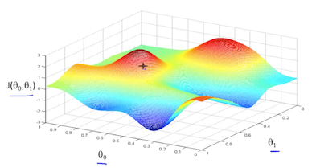
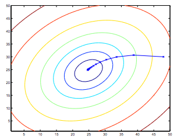

# [Coursera Machine Learning course](https://www.coursera.org/learn/machine-learning)

## Week 1

### What is Machine Learning

> The field of study that gives computers the ability to learn without being explicitly programmed.
> – Arthur Samuel

More recently:

> A computer program is said to learn from experience E, with respect to some task T, and some performance measure P, if its performance on T as measured by P improves with experience E.
> – Tom Mitchel

Example: playing checkers.

- E = the experience of playing many games of checkers
- T = the task of playing checkers.
- P = the probability that the program will win the next game.

Types of machine learning:

- Supervised learning
- Unsupervised learning
- (Reinforcement learning)
- (Recommender systems)

### Supervised Learning

Example: house prices, "right answers" are given

"Fit a model in the data"

- **Regression** problem: Continuous value output
- **Classification** problem: Discrete valued output

Feature = attribute

### Unsupervised Learning

Structure of the data - clusters

Applications of clustering algorithms:

- Computing clusters organisation
- Market segmentation
- Social network analysis
- Astronomical data analysis

### Model Representation

Linear regression!

Housing prices: Price (1000s $), Size (feet squared)

Training set

Notation:

- **m** = Number of training examples
- **x**'s = "input" variable / features
- **y**'s = "output" variable / "target" variable
- **(x, y)** = One training example
- **(x(i), y(i))** = i-th training example

"Univariate" linear regression

> learn a function h : X → Y so that h(x) is a “good” predictor for the corresponding value of y. For historical reasons, this function h is called a hypothesis.

```
          ┌─────────────────┐
          │   Training set   │
          │                  │
          └─────────────────┘
                   │
                   │
                   ▼
          ┌─────────────────┐
          │    Learning      │
          │    algorithm     │
          └─────────────────┘
                   │
                   │
      x            ▼        predicted y
                 ┌───┐
(living area ───▶│ h │───▶  (predicted
  of house)      └───┘    price of house)
```

### Cost function

"Minimise the difference between the hypotheses and the actual value"

Squared error function: Average difference (actually a fancier version of an average) of all the results of the hypothesis with inputs from x's and the actual output y's.

Works well for most problems. Most common (for linear regression problems). There are other cost functions.

Contour plots - charts concentric circles of equal values for a given set of variables

### Gradient descent

Very common algorithm. Not just linear regression.

- Start with some θ0 and θ1
- Keep changing θ0, 01 to reduce J(θ0, θ1) until we hopefully end up at a minimum

Local minimums / local optimums! Common starting value: 0, 0



Follow the derivative (tangent line) of the cost function, down slope.

Simultaneous updated of both θ0 and θ1 (interdependent)

Alpha gradient descent step:

- Too small, gradient descent too slow
- Too large, overshoot the minimum, fail to converge, *or even diverge*.

Eventually converges regardless of learning rate alpha, because derivative tends to 0, thus taking smaller steps.

Convex function (bowl shaped): no local optima, just one global optimum.

Quadratic gradient descent:



## Matrices and Vectors

> Matrix: Rectangular array of numbers

Dimension of matrix: number of rows x number of columns

> Vector: Matrix with n x 1 dimension

Identity matrix, denoted I or ][n*m
