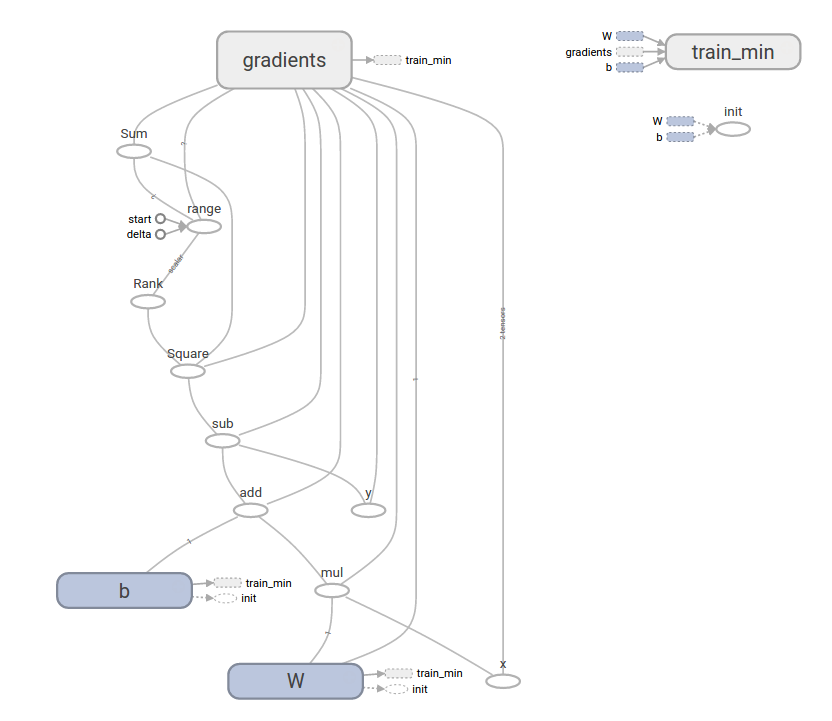

# [TensorFlow](https://www.tensorflow.org/)

https://www.tensorflow.org/get_started/

## [Getting Started](https://www.tensorflow.org/get_started/get_started) notes

```sh
# First musings.
./getting_started.py
# First real model with training.
./getting_started_train.py
# Higher-level API.
./getting_started_learn.py
# Combination of high-level and low-level.
./getting_started_custom.py

Multiple APIs:

- Low-level, TensorFlow Core.
- Higher-level, built on top of TensorFlow Core.

Vocabulary

- Tensor = set of primitive values shaped into an array of any number of dimensions.
- Rank of a tensor = number of dimensions.
- Placeholder = Promise to provide a value later.
- Variables = Trainable parameters of the model.
- Loss function = Measures how far apart the model and provided data are.
- Gradient descent = Optimizer. Modifies each variable according to the magnitude of the derivative of loss with respect to that variable.

To revisit

- Gradient descent

### Final program


